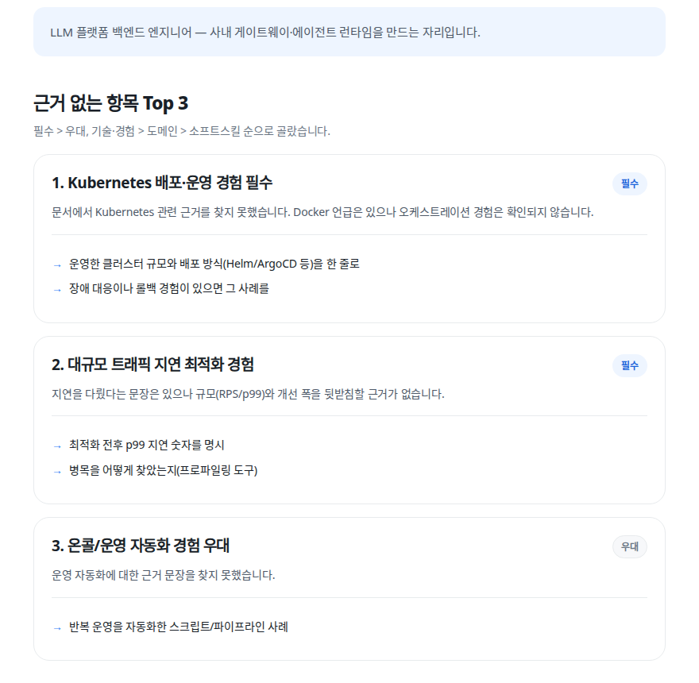

# jd-gap-analyzer

채용 공고와 지원 문서를 넣으면, **공고가 요구하는데 문서에 근거가 없는 항목 Top 3**을 원문 인용과 함께 뽑아주는 도구.

**웹: https://jd-gap-zweadfxs-projects.vercel.app** (무료 · 문서 저장 안 함)

공고가 **이미지**라면 업로드로 전사(비전 모델)해 입력창에 채워준다 — 유저가 확인·수정한 뒤 기존 파이프라인 그대로 분석한다. 이력서가 **PDF**라면 브라우저에서 텍스트를 추출해 채운다(파일이 서버로 가지 않는다).



```bash
# CLI로도 돈다
uv run python -m src.cli --job data/samples/job1.txt --resume data/samples/resume.txt
```

> 모델·프롬프트 동결(`prompt_hash 72be9be37431`). 아래 수치는 실제 채용 공고 **7건 × 2회** 실측이다.

---

## 문제 정의

지원자는 자기 이력서의 구멍을 못 본다.

공고를 읽으면서 이력서를 떠올릴 때, 사람은 **없는 것을 있다고 착각한다.** "Kubernetes 운영 경험"을 읽고 "Docker 써봤으니 비슷하지"라고 넘어간다. 이력서에는 Docker라는 단어조차 없는데도. 자기 경력에 대한 기억이 이력서 원문보다 풍부하기 때문에 생기는 착시다.

서류에서 떨어지고 나면 **왜 떨어졌는지 알 수 없다.** 피드백은 오지 않는다.

이 도구는 그 착시를 걷어낸다. 공고의 요구사항을 하나씩 세우고, 각각에 대해 **문서 원문에서 근거 문장을 찾아 붙인다.** 근거를 못 찾으면 못 찾았다고 말한다. 그게 갭이다.

## 왜 첨삭이 아니라 갭만 보여주는가

이력서를 대신 고쳐주는 도구는 이미 많다. 이 도구는 의도적으로 그걸 하지 않는다.

**첫째, 첨삭 결과는 유저가 검증할 수 없다.** LLM이 다듬어준 문장은 항상 그럴듯해 보인다. 좋아진 건지 그냥 매끄러워진 건지 판단할 근거가 유저에게 없다. 반면 "이 요구사항에 대한 근거가 문서에 없다"는 주장은 **유저가 자기 문서를 보고 5초 만에 참/거짓을 확인할 수 있다.** 검증 가능한 출력만 낸다.

**둘째, 첨삭은 거짓말을 유도한다.** "LLM 운영 경험이 부족하다"는 진단에 대해 첨삭 도구는 그럴듯한 문장을 채워 넣으려 한다. 그건 지원자를 면접장에서 죽인다. 이 도구는 문장을 써주는 대신 **무엇을 실제로 해야 그 칸이 채워지는지**를 제안한다.

**셋째, 갭만 보여줘도 제품이다.** 진단과 처방 중 하나를 골라야 한다면 진단이 먼저다.

## 안 만든 것과 그 이유

기능을 뺀 것은 시간이 없어서가 아니라 **넣으면 나빠지기 때문이다.**

| 안 만든 것 | 이유 |
|---|---|
| **합격 확률 점수** | 근거 없는 숫자는 신뢰를 깎는다. "72% 적합"이 무슨 뜻인지 아무도 설명할 수 없다 |
| **이력서 자동 첨삭/재작성** | 위 참조. 검증 불가능한 출력 + 거짓말 유도 |
| **공고 URL 크롤링** | 사이트마다 DOM이 달라 시간 블랙홀. 붙여넣기로 충분하다 |
| **PDF 업로드/파싱** | 품질 숫자는 깨끗한 텍스트로 잰 값이다. 표 기반 한국 이력서 PDF는 추출 시 텍스트가 뒤섞여 새 실패 표면이 된다. 대신 붙여넣기 힌트를 두고, 전환율(page_view→submit)로 마찰 가설을 검증한다 |
| **로그인 / 저장 / 히스토리** | 핵심 가치가 검증되기 전에 만드는 계정 시스템은 낭비다 |
| **테스트 코드** | 5일 스코프. 대신 `verify.py`의 검증 로직만은 손으로 돌려서 확인한다 |
| **타입 체커(mypy)** | 5일 프로젝트에 설정 오버헤드 |

## quote 원문 검증 — 이 프로젝트의 핵심

**LLM은 근거를 지어낸다.** 프롬프트로 "원문을 그대로 복사하라"고 몇 번을 말해도, 일부는 요약하거나 매끄럽게 다듬어서 돌려준다. 문제는 그렇게 지어낸 문장이 **진짜 인용보다 더 그럴듯해 보인다**는 것이다.

근거가 가짜면 이 도구는 존재 이유가 없다. 그래서 프롬프트를 믿지 않고 **코드로 대조한다.**

```python
for ev in analysis.evidences:
    if ev.quote and normalize(ev.quote) not in normalize(resume_text):
        ev.quote = None
        ev.status = "없음"      # 원문에 없는 인용 = 근거 없음으로 강등
        hallucination_count += 1
```

**강등이지 삭제가 아니다.** 지어낸 인용을 그냥 지우면 그 항목은 "근거를 못 찾은 항목"으로 조용히 사라진다. 그러면 갭이 숨는다. 원문에 없는 인용은 **근거가 없다는 뜻**이므로 `status="없음"`으로 내리고, 그 항목은 Top 3 후보로 올라간다.

**`normalize`는 공백·개행·전각문자만 흡수한다.** 더 느슨하게 하면(부분 일치, 조사 제거 등) 지어낸 문장이 통과해서 검증 자체가 무의미해진다. 더 엄격하게 하면 줄바꿈 하나 때문에 진짜 인용이 강등된다. 그 사이의 가장 좁은 지점을 잡았다.

**강등 횟수는 항상 출력에 표시된다.** 조용히 처리하면 이 도구가 얼마나 LLM을 못 믿고 있는지 유저가 알 수 없다.

**실측 (실제 공고 7건 × 2회 = 14회):** 모델이 제시한 인용 99건 중 **11건이 원문에 없었다(강등률 11%)**. 한 실행에서는 인용 10건 중 5건이 가짜였다. **이 방어선이 없으면 그 5건이 "근거 있음"으로 유저에게 나갔을 것이다.**

가짜 quote를 손으로 주입해 검증기가 실제로 발동하는지도 확인했다(`scripts/check_verify.py`) — 한 번도 발동한 적 없는 검증기는 코드상 no-op과 구별되지 않기 때문이다.

## 파이프라인 — 왜 3단계로 쪼갰나

```
[Step 1] 공고 → 요구사항 체크리스트
         이 단계에 지원 문서를 넣지 않는다
              ↓
[Step 2] 요구사항 + 지원 문서 → 근거 매칭
              ↓ (여기서 quote 원문 검증)
[Step 3] 근거 없는 항목 Top 3 → 보완 제안
```

한 번에 시키면 **LLM이 문서를 보고 요구사항을 거기에 맞춰 뽑는다.** 문서에 있는 것 위주로 체크리스트가 만들어지고, 갭은 마법처럼 사라진다. 공고를 독립적으로 먼저 분해해야 갭이 정직하게 드러난다.

Step 1 함수는 아예 **지원 문서를 인자로 받지 않는다.** 주석으로 적어두는 대신 시그니처로 막았다.

Top 3 **선정은 LLM이 아니라 코드가 한다.** 우선순위(필수 > 우대, 기술/경험 > 도메인 > 소프트스킬)와 공고 원문 등장 순서 타이브레이커는 결정론적이어야 한다. LLM에 맡기면 실행마다 순서가 흔들려서 프롬프트를 고쳤을 때 뭐가 달라졌는지 비교할 수 없다. 같은 이유로 `temperature=0`.

## 측정 결과

`gpt-5.4-nano` · 실제 채용 공고 **7건 × 2회 = 14회** · `prompt_hash 72be9be37431`

| 항목 | 값 |
|---|---|
| **Top 3 정확도** (Top 3 항목 중 진짜 갭) | **7 / 8** (사람 판정, 판정 기준 사전 커밋) |
| **발견율** (요구사항 중 근거를 찾은 비율) | 중앙값 **48%** |
| **강등률** (제시한 인용 중 원문에 없던 비율) | **11%** (99건 중 11건) |
| 지연 — 서버 처리 (Step 1+2) | 약 **10초** |
| 지연 — 웹 왕복 (전체 파이프라인 + 네트워크) | 약 **13초** |
| 실행당 비용 | 약 **$0.0032** |

<sub>Top 3 정확도 분모: 공고 3건 × Top 3 = 9개가 될 예정이었으나, 1건은 근거 없음 항목이 2개뿐이라 실제 판정 대상은 8개였다.</sub>

**Top 3 정확도는 사람이 손으로 판정했다.** LLM이 LLM 출력을 채점하면 순환이라 그 숫자는 의미가 없다. 결과를 보기 전에 판정 기준을 커밋하고([CONVENTIONS.md](CONVENTIONS.md)의 "Top 3 정확도 게이트"), 각 항목을 "진짜 갭 / 거짓 갭(문서에 있는데 못 찾음) / 무의미(인성·조건완화가 필터를 뚫음)"로 분류했다. 8개 중 7개가 진짜 갭이었다.

**모델도 측정해서 골랐다.** `gpt-4o-mini`와 비교해 7개 공고 **전부**에서 발견율이 높았고(부호 검정 7/7, 우연일 확률 ≈0.8%), 지연은 절반이었다. 결정적이었던 건 발견율이 아니라 **`gpt-4o-mini`가 두 공고에서 인용을 하나도 제시하지 않았다는 것**이다(14회 중 4회). 요구사항 8개·15개 전부 "근거 없음"으로 판정했다 — 제품이 작동하지 않은 것이다. 그 모델의 "지어내기율 0%"는 정직해서가 아니라 **아무것도 안 해서** 나온 숫자였다. 그래서 지어내기율과 발견율을 반드시 짝으로 본다.

**이미지 공고 전사 (B안, `gpt-5.5` · 실제 이미지 공고 5건×22타일 실측):**

| 항목 | 값 |
|---|---|
| 건당 비용 | **$0.066~$0.277** (평균 $0.16) |
| 건당 지연 | **26~100초** |
| 가드 | 전역 **10회/일** · IP **2회/일** (도달 시 로그 보고 의식적 상향) |

이력서 PDF 추출은 브라우저(pdf.js)에서 처리된다 — **비용·서버 부하 0.**

## 실사용 — 관측 중

2026-07-15 배포. 아래 지표는 관측이 끝나면 실측값으로 채운다. 정의는 데이터를 보기 전에 박아둔다 — 숫자를 보고 정의를 고르면 그게 사후 합리화다.

| 지표             | 정의 (사전 확정)                                         | 값     |
|------------------|----------------------------------------------------------|--------|
| 방문자           | page_view를 남긴 서로 다른 anon_id                       | 미측정 |
| 사용자           | result_shown까지 도달한 서로 다른 anon_id                | 미측정 |
| 방문→분석 전환율 | 사용자 / 방문자                                          | 미측정 |
| 재방문           | 같은 anon_id가 서로 다른 KST 날짜 2일 이상 이벤트를 남김 | 미측정 |
| 에러율           | error 이벤트 / submit                                    | 미측정 |

<sub>anon_id는 localStorage 기반이라 기기 간 추적이 안 된다. 같은 사람이 폰과 PC로 오면 2명으로 세고, 재방문은 놓친다. 즉 방문자는 상한이 아니라 근사치, 재방문은 하한선이다. 테스트 이벤트(verify_* 등)는 집계에서 제외한다(src/events.py의 is_test_anon).</sub>

## 아키텍처

같은 파이프라인을 CLI와 웹이 공유한다. 웹은 파이프라인을 **호출만** 한다 — 사본을 만들면 웹에서만 나는 버그가 생기고, 프롬프트를 고칠 때 한쪽을 빠뜨린다.

```
CLI  ─┐
      ├─→ src.pipeline.analyze(job, resume)  →  Step 1/2/3 + quote 검증
웹   ─┘

[웹]  Vercel(Next.js 프론트)  ──HTTPS──▶  Railway(FastAPI)  ──▶  analyze()
                                              │
                                              ├─ 응답: 유저에게 보일 필드만 화이트리스트
                                              │   (프롬프트·원본 응답에 든 문서 전문은 반환 안 함)
                                              └─ events.jsonl (영구 볼륨)
                                                  page_view / submit / result_shown / error
                                                  ─ 공고·문서 원문은 로그에 넣지 않는다.
                                                    길이·요구사항 수·강등 수 같은 메타만.
```

- **프론트와 API는 다른 도메인이다.** 재방문을 잇는 `anon_id`는 쿠키가 아니라 프론트의 `localStorage`에서 만들어 헤더로 보낸다(쿠키는 서드파티가 되어 브라우저에 차단된다).
- **로깅은 자체 `events.jsonl`이다.** PostHog 같은 외부 도구는 타깃이 개발자라 애드블록에 차단된다 — 차단된 이벤트는 조용히 사라지고 퍼널이 조용히 틀려진다.
- **볼륨에 쌓인다(서버리스 아님).** 서버리스는 로그가 증발한다. 배포 후 10분 방치 후 첫 요청을 실측해 콜드 스타트가 없음을 확인했다(첫 요청 0.36초 vs 웜 0.22초).
- **서버에 유저 문서를 파일로 쌓지 않는다.** CLI의 `save_run()`을 웹에서는 부르지 않는다.

## 판단의 기록

이 프로젝트에서 실제로 무엇을 결정했고 무엇을 틀렸는지. 서사는 링크 너머에 있다.

**폐기된 전제들.** `temperature=0`이면 재현된다고 가정했다가 실측으로 깨졌고, 관측 도구 자체가 틀려 잘못된 보고를 낸 결함을 3건 잡았다("category가 5/7건 흔들린다"는 실제로 0건이었다 — 지문을 개수로만 비교한 버그). 폐기 과정과 원문은 [CONVENTIONS.md](CONVENTIONS.md)에 강등 표시로 남겼다.

**프롬프트 2회 시도 → 2회 revert.** Step 2의 "약함/없음 경계"를 프롬프트로 제어하려 두 번 시도했고 둘 다 사전 커밋한 기준에서 실패해 `git revert`로 동결 상태를 복원했다. 2차 시도는 지시문에 반례를 명시했는데("요구 'SSoT 원칙' ← 문서 '지수 백오프' → 없음"), **모델이 그 반례를 두 회차 모두 그대로 위반**했다. 이 티어의 모델에서 그 경계는 프롬프트로 제어되지 않는다는 결론이다(`git log --grep="약함/없음"`).

**모델 선정.** "지어내기율이 높으면 탈락"이라는 규칙을 먼저 세웠다가 폐기했다 — quote를 아예 안 내면 지어내기율이 0%가 되어 **게으른 모델이 1등이 되는** 함정이었다. 대신 발견율을 우선하고 지어내기율은 "최종 출력에 남는 위험"과 짝으로 봤다. 부호 검정 7/7로 `gpt-5.4-nano`를 골랐다([CONVENTIONS.md](CONVENTIONS.md)의 "폐기된 규칙 #1").

**Top 3 정확도는 사람이 판정했다.** 위 [측정 결과](#측정-결과) 참조. 판정 기준을 결과 전에 커밋한 것이 핵심이다 — 결과를 보고 기준을 만들면 마음에 드는 쪽으로 기준이 휜다.

**이미지 공고 전사는 게이트 두 번을 거쳐 들어왔다.** 실사용 제보와 커뮤니티 운영진(현직자)의 요구로 시작했지만, 착수 전에 스파이크를 게이트로 박았다 — 실제 이미지 공고 5건을 전사해 원본과 눈대조하고, 품질이 부족하면 기능 자체를 접는다. 1차(`gpt-5.4-nano`)는 불통과였다: 작은 글자·표 유형에서 "전문학사 이상 → 전문학습 이수" 같은 **문법적으로 자연스러운 왜곡**과 자격 조건의 의미 반전이 나왔다. 원본 없이 전사만 보면 틀린 걸 알아챌 수 없는, 이 프로젝트가 quote 검증을 만든 이유와 같은 실패 모드다. "nano 실패 ≠ 비전 실패"이므로 **모델만 `gpt-5.5`로 바꾸고 나머지 전 변인(이미지·타일링·프롬프트·판정 기준·판정자)을 동결**한 재측정을 사전 등록했다 — 마지막 시도이며 불통과 시 영구 폐기라는 조건과 함께. 5.5는 1차 왜곡 지점 전수 원문 일치로 통과했다. 단 5.5도 장소 고유명사 1건을 문맥상 그럴듯한 회사명으로 치환했다("영도대교" → 채용사명). 그래서 **전사 결과를 유저가 확인·수정하는 단계를 형식이 아니라 실질 안전선으로** 설계했고, 이미지→요구사항 직행을 금지하고 **전사만** 시켜 동결 파이프라인(`72be9be37431`)을 그대로 유지했다.

## 한계

솔직하게 적는다. 아래는 **실측에서 관찰된 것들**이고, 고치지 않고 기록했다. D2 종료 시점에 프롬프트를 동결했기 때문이다 — "한 번만 더 고치면 될 것 같은데"가 이 프로젝트에서 가장 그럴듯한 실패 모드였다.

**측정 표본이 7건이다** (목표 10건 미달). 아래 숫자들은 그 한계 위에 있다.

**"약함/없음" 경계가 프롬프트로 제어되지 않는다.** 부분적·인접 근거를 "약함"으로 살릴지 "없음"으로 내릴지가 이 도구의 유일하게 측정된 거짓 갭 원인이다. 두 번의 프롬프트 수정으로 잡으려다 실패했다(위 [판단의 기록](#판단의-기록)). 지금은 기본값을 "애매하면 없음"으로 두고 동결했다.

**영어 공고에서 출력 언어가 흔들린다.** 요구사항을 한국어로 번역하라고 지시했지만 **2회 실행 중 1회는 전부 영어로 나온다.** 지원 문서가 한국어인데 요구사항이 영어면 대조가 어렵다. 프롬프트 한 줄로는 안 먹혔고, 영어 공고는 1건만 테스트했다.

**자격요건이 형식적인 공고에서 요구사항이 부풀려진다.** 인성 항목("오픈 마인드" 등)을 걷어내는 필터를 넣었더니, 자격요건이 3개뿐이고 그중 2개가 인성 항목이던 공고에서 **요구사항이 8개 → 14개로 늘었다.** 필터가 요구사항을 비우자 모델이 "주요 업무" 섹션에서 8개를 끌어와 채웠다.

**OR 조건의 판정이 실행마다 뒤집힌다.** `"실무 경험 또는 깊은 관심이 있는 분"` 같은 항목은 "또는 깊은 관심"이 붙는 순간 사실상 누구나 충족한다. 갭으로 잡을지 말지가 실행마다 달라진다.

**강등은 "원문에 있는가"만 본다. quote의 관련성은 검증하지 않는다.** 지어내기(hallucination)는 막지만 오인용(misattribution)은 막지 못한다. 원문에서 엉뚱한 문장을 가져와도 실재하기만 하면 강등되지 않는다.

```
원문:  "Kubernetes 경험은 없습니다"
quote: "Kubernetes 경험"          ← 원문에 실재 → 강등 안 됨
```

그래서 quote가 완결된 문장 1~2개와 일치하지 않으면 **경고**를 띄운다(강등하지는 않는다 — 원문에 실재하는 이상 지어낸 것이 아니고, 진짜 근거를 버리는 것은 갭을 숨기는 것만큼 나쁘다). **최종 판단은 사람이 한다.**

**LLM 판정은 실행마다 같지 않다.** `temperature=0`으로 고정했는데도 그렇다. 같은 입력·같은 프롬프트로 돌린 두 실행에서 근거 개수가 3개 → 4개로 달라졌다. 그래서 코드를 동결한 채 반복 측정해 노이즈 플로어를 쟀고, **그보다 작은 변화는 "개선했다"고 주장하지 않는다.** `seed`는 넣지 않았다 — best-effort라 의존할 수 없는데 의존하고 싶게 만든다.

**이미지 전사는 고유명사를 문맥상 그럴듯한 단어로 치환할 수 있다.** 게이트를 통과한 모델도 장소 이름 1건을 채용사명으로 바꿨다(실측). 그래서 전사 결과가 채워진 뒤 확인·수정을 권장하는 안내를 띄운다 — 최종 입력은 유저가 확정한다.

**스캔본 PDF는 지원하지 않는다.** 텍스트 레이어가 있어야 추출된다. 없는 경우(추출 결과가 사실상 빈 경우) 붙여넣기 안내만 한다.

**"근거 없음"이 "능력 없음"은 아니다.** 문서에 안 썼을 뿐 실제로는 해본 일일 수 있다. 이 도구가 판정하는 것은 **문서의 상태**지 사람의 실력이 아니다. 오히려 그게 유용한데, 서류 심사자도 문서만 보기 때문이다.

## 스택

Python 3.12 · OpenAI `gpt-5.4-nano` (structured output) · Pydantic v2 · uv · Ruff

웹: Next.js (Vercel) + FastAPI (Railway, 영구 볼륨)

## 실행

```bash
uv sync
cp .env.example .env        # OPENAI_API_KEY 입력
uv run python -m src.cli --job data/samples/job1.txt --resume data/samples/resume.txt
```

각 실행의 원본 LLM 응답은 `out/run_<timestamp>.json`에 저장되고, **이 파일은 커밋된다.** 프롬프트 수정(`prompt:` 커밋)과 그 결과가 같은 커밋에 들어가야 "이 수정이 이 결과를 만들었다"가 증명되기 때문이다. 각 기록에는 `prompt_hash`가 박혀 있어서, 나중에 "강등률이 낮았던 실행은 어떤 프롬프트 버전이었나"를 코드로 뽑을 수 있다.

실제 이력서로 돌린 결과는 `out/private/`로 가고 커밋되지 않는다(`out/run_*.json`에는 문서 전문이 들어간다). 규율이 아니라 코드가 입력 경로를 보고 라우팅한다.

검증 로직의 경계는 프레임워크 없이 확인한다:

```bash
uv run python scripts/check_verify.py
```

개발 규칙과 폐기된 전제들의 전체 기록은 [CONVENTIONS.md](CONVENTIONS.md) 참조.
